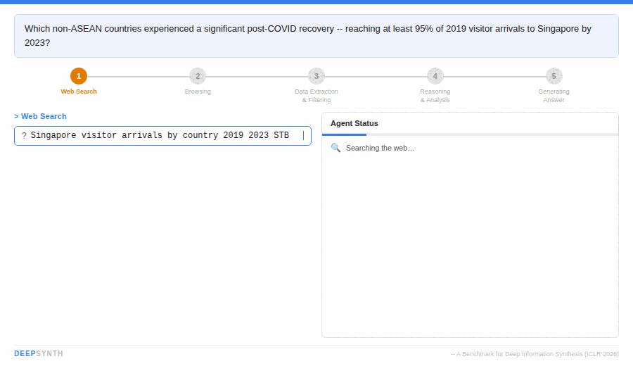

<p align="center">
  
</p>

<h1 align="center">DEEPSYNTH: A Benchmark for Deep Information Synthesis</h1>

<p align="center">
  <a href="https://openreview.net/pdf?id=0Dhpt9aY3n"></a>
  <a href="https://arxiv.org/abs/2602.21143"></a>
  <a href="https://huggingface.co/datasets/DeepSynthesisTeam/deepsynth-bench"></a>
  <a href="https://huggingface.co/spaces/DeepSynthesisTeam/deepsynth-leaderboard"></a>
  <a href="https://agentdeepsynthesis.github.io/deepsynth.github.io/"></a>
  <a href="LICENSE"></a>
  
</p>

<p align="center">
  
</p>

> **TL;DR** — DEEPSYNTH is a benchmark of **120 expert-curated tasks** across **7 domains** and **67 countries** that evaluates LLM agents on **multi-step web information synthesis**. State-of-the-art systems reach only **8.97 F1 / 17.5 LLM-Judge** — leaving plenty of headroom.

---

## 📋 Table of Contents

- [Leaderboard](#-leaderboard)
- [Quickstart](#-quickstart)
- [Dataset](#-dataset)
- [Evaluation](#-evaluation)
- [Submitting to the Leaderboard](#-submitting-to-the-leaderboard)
- [Baselines](#-baselines)
- [Citation](#-citation)

---

## 🏆 Leaderboard

Live, interactive leaderboard: **[huggingface.co/spaces/DeepSynthesisTeam/deepsynth-leaderboard](https://huggingface.co/spaces/DeepSynthesisTeam/deepsynth-leaderboard)**

### Test set — 80 held-out tasks · Pass@1

| Rank | Agent | Base model | Access | F1 | Precision | Recall | EM | LLM Judge |
|:----:|-------|-----------|:------:|----:|----------:|-------:|----:|----------:|
| 🥇 1 | o3-deep-research | o3-deep-research (2025-08) | 🔒 | **8.97** | 7.73 | 10.69 | 2.50 | **17.50** |
| 🥈 2 | GPT-5.2-Pro | gpt-5.2-pro (2026-02) | 🔒 | 8.70 | 8.45 | 8.96 | **6.25** | 6.67 |
| 🥉 3 | Smolagent-GPT5 | gpt-5 | 🔓 | 6.42 | 6.34 | 6.50 | 1.67 | 2.50 |
| 4 | Gemini-Pro-2.5 | gemini-pro-2.5 (2025-08) | 🔒 | 6.25 | 4.71 | 9.27 | 0.00 | 5.00 |
| 5 | OWL-GPT4.1 | gpt-4.1 | 🔓 | 5.41 | 4.62 | 6.52 | 1.67 | 12.50 |
| 6 | GPT-5.1 | gpt-5.1 (2025-08) | 🔒 | 3.83 | 2.98 | 5.37 | 0.00 | 0.00 |
| 7 | Smolagent-GPT4.1 | gpt-4.1 | 🔓 | 3.75 | 3.27 | 4.39 | 2.50 | 7.50 |
| 8 | GPT-4.1 | gpt-4.1 (2025-08) | 🔒 | 3.46 | 2.86 | 4.39 | 0.00 | 0.00 |
| 9 | o3 | o3 (2025-08) | 🔒 | 3.29 | 2.85 | 3.90 | 0.00 | 0.00 |
| 10 | DeepSeek-R1-Chat | deepseek-r1-chat (2025-08) | 🔓 | 3.23 | 2.75 | 3.90 | 1.67 | 2.50 |
| 11 | o4-mini | o4-mini (2025-08) | 🔒 | 3.05 | 2.33 | 4.39 | 0.00 | 0.00 |
| 12 | DeepSeek-R1-Reasoner | deepseek-r1 (2026-02) | 🔓 | 2.80 | 2.73 | 2.87 | 2.50 | 6.67 |

🔒 closed model · 🔓 open-weights. Ranked by F1; LLM Judge used as tiebreaker.

### Dev set — 40 public tasks · Pass@1

Self-reported numbers on the public dev split. Anyone can score themselves locally with the gold answers released alongside the questions.

| Rank | Agent | F1 | LLM Judge |
|:----:|-------|----:|----------:|
| 🥇 1 | GPT-5.2 | **15.6** | 5.0 |
| 🥈 2 | o3-deep-research | 9.9 | **20.0** |
| 🥉 3 | Gemini-Pro-3 | 8.6 | 15.0 |
| 4 | o3 | 6.3 | 10.0 |
| 5 | Smolagent-GPT4.1 | 6.3 | 7.5 |
| 6 | GPT-5.1 | 6.2 | 12.5 |
| 7 | Gemini-Pro-2.5 | 5.9 | 5.0 |
| 8 | DeepSeek-Reasoner | 5.0 | 7.5 |
| 9 | OWL-GPT4.1 | 4.1 | 12.5 |
| 10 | o4-mini | 3.3 | 2.5 |
| 11 | DeepSeek-Chat | 2.1 | 5.0 |
| 12 | GPT-4.1 | 1.8 | 7.5 |

📈 Submit your agent → **[Submit tab on the leaderboard](https://huggingface.co/spaces/DeepSynthesisTeam/deepsynth-leaderboard)** or open a PR to this repo.

---

## 🚀 Quickstart

```bash
# 1. Clone
git clone https://github.com/agentdeepsynthesis/deepsynth-bench
cd deepsynth-bench

# 2. Install
pip install -r requirements.txt

# 3. Download the dev set from Hugging Face
python -c "
from huggingface_hub import hf_hub_download
import json

dev_path = hf_hub_download(
    repo_id='DeepSynthesisTeam/deepsynth-bench',
    filename='DEEPSYNTH_lite.json',
    repo_type='dataset',
)
with open(dev_path) as f:
    tasks = json.load(f)
print(f'Loaded {len(tasks)} dev tasks')
"

# 4. Evaluate a sample prediction file
python scripts/evaluation/eval_static_score.py \
    --predictions examples/sample_predictions.json \
    --split dev
```

---

## 📚 Dataset

DEEPSYNTH is hosted on the Hugging Face Hub:
**[`DeepSynthesisTeam/deepsynth-bench`](https://huggingface.co/datasets/DeepSynthesisTeam/deepsynth-bench)**

The benchmark ships as **120 expert-curated tasks** in two splits:

| File | Tasks | Description |
|------|------:|-------------|
| `DEEPSYNTH_lite.json` | 40 | **Dev set** — questions, gold answers, and full decompositions with intermediate answers. Use for prototyping, debugging, and local scoring. |
| `deepsynth_questions_only_all.json` | 80 | **Test set** — questions only. Gold answers are held private; submit predictions via the leaderboard. |
| `decompositions/*.json` | — | Intermediate-answer decompositions for dev tasks. |
| `intermediate_answers_schemas/*.json` | — | JSON Schemas defining intermediate-answer formats. |

```python
from huggingface_hub import hf_hub_download
import json

path = hf_hub_download(
    repo_id="DeepSynthesisTeam/deepsynth-bench",
    filename="DEEPSYNTH_lite.json",
    repo_type="dataset",
)
tasks = json.load(open(path))
```

---

## 📊 Evaluation

DEEPSYNTH reports five complementary metrics:

| Metric | What it measures |
|--------|------------------|
| **F1 / Precision / Recall** | Token-level overlap between predicted and gold answers, averaged over tasks. |
| **Exact Match (EM)** | Fraction of tasks where predicted == gold (strict structured-equality check). |
| **LLM Judge** | Semantic-equivalence scoring with small numerical tolerance (1–5.5%), via a strong frozen judge model. |

Run evaluation locally:

```bash
python scripts/evaluation/eval_static_score.py \
    --predictions your_predictions.json \
    --split dev
```

### Prediction format

```json
{
  "001": {"Sweden": 1.2, "Finland": 0.8},
  "002": {"Brunei": -0.67, "Singapore": -0.34}
}
```

For **leaderboard submissions** (test split), wrap predictions in the full submission schema — see below.

---

## 📤 Submitting to the Leaderboard

We accept submissions **two ways** — pick whichever is easier:

### 🤗 Option A — Upload form on the Leaderboard Space

Fastest path. Go to the [**Submit tab**](https://huggingface.co/spaces/DeepSynthesisTeam/deepsynth-leaderboard) on the Hugging Face Space, fill in your agent's metadata, upload your predictions JSON, and submit. A maintainer reviews and scores it within about a week.

### 🔀 Option B — Pull request (for Git-native workflows)

1. Produce a submission JSON conforming to [`scripts/evaluation/submission_schema.json`](scripts/evaluation/submission_schema.json) — metadata block + predictions map.
2. Validate locally:
   ```bash
   python scripts/evaluation/validate_submission.py my_submission.json --strict
   ```
3. Fork this repo, add your file under `submissions/YYYY-MM-DD-org-agentname.json`, and open a PR.
4. CI validates the schema; a maintainer reviews and merges.

### What we require

- **Public `code_url`** that reproduces your numbers. Submissions without reproducible code won't be accepted.
- **Honest metadata.** Misreporting scaffold or tool access is grounds for retraction.
- We may request a run trace for spot-check verification.

### Retraction policy

Email the contact on the submission. Corrections and retractions are logged transparently in the leaderboard history.

---

## 🧪 Baselines

Runnable baseline agents live in [`scripts/baselines/`](scripts/baselines/):

- `vanilla/` — LLM-only, no tools.
- `react/` — ReAct with web search and Python.
- `codeact/` — CodeAct style with full Python sandbox.
- `plan_and_execute/` — Two-stage planner + executor.

Each baseline has its own `README.md` with setup, API key requirements, and an end-to-end run command.

---

## 📜 Citation

If you use DEEPSYNTH in your research, please cite:

```bibtex
@inproceedings{paul2026deepsynth,
  title     = {{DEEPSYNTH}: A Benchmark for Deep Information Synthesis},
  author    = {Debjit Paul and Daniel Murphy and Milan Gritta and Ronald Cardenas and Victor Prokhorov
               and Lena Sophia Bolliger and Aysim Toker and Roy Miles and Andreea-Maria Oncescu and
               Jasivan Alex Sivakumar and Philipp Borchert and Ismail Elezi and Meiru Zhang and
               Ka Yiu Lee and Guchun Zhang and Jun Wang and Gerasimos Lampouras},
  booktitle = {The Fourteenth International Conference on Learning Representations (ICLR)},
  year      = {2026},
  url       = {https://openreview.net/forum?id=0Dhpt9aY3n}
}
```

A [`CITATION.cff`](CITATION.cff) file is provided for GitHub's "Cite this repository" button.

---

## 📄 License

Apache License 2.0. See [LICENSE](LICENSE).

## 🙏 Acknowledgements

Developed across Huawei Noah's Ark Lab, Imperial College London, UCL Centre for AI, University of Zurich, University of Sheffield, and University of Cambridge.

> *Disclaimer: This open-source project is not an official Huawei product; Huawei is not expected to provide support.*